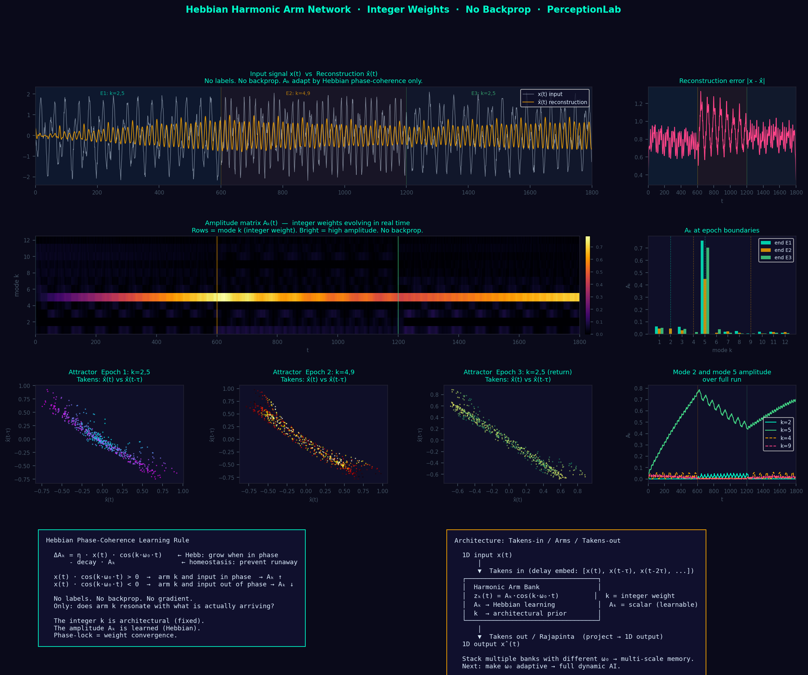

# Takens In, Takens Out: The Dynamic AI Architecture

Paper: harmonic_integer_weights_paper.md

 

  
  


> **"Consciousness is a geometric latent space trapped between a 1D input bottleneck and a 1D output bottleneck."**

This repository explores a novel paradigm for artificial intelligence and neuroscience, moving away from static matrix multiplications (like Transformers/LLMs) and toward **continuous, dynamical geometry**.

It proposes that the fundamental unit of computation in the brain is not a scalar weight, but an integer-period delay line (a **Harmonic Arm**). By framing perception and action as a cycle of topological folding and unfolding, it bridges the gap between Noncommutative Geometry, the Takens Embedding Theorem, and the mammalian neocortex.

---

## 🧠 The Core Concept: Takens-In / Takens-Out

Current AI models (LLMs) operate on discrete, static tokens using learned embedding matrices. This framework proposes a **continuous, geometric** alternative mapped directly to human neurobiology:

1. **Takens-In (Sensory Input):**  
   The brain receives a 1D signal (e.g., sound). Dendrites act as fixed, absolute-time delay lines, inflating the 1D time-series into a high-dimensional geometric manifold (Forward Takens Embedding).

2. **The Latent Space (Cortical Processing):**  
   Inside the cortex, these massive geometries overlap and compute through structural interference (Moiré Attention) and phase-locking. The weights are not scalar values; they are **integers** corresponding to resonant frequencies.

3. **Takens-Out (Rajapinta / Motor Output):**  
   The brain collapses this high-dimensional geometry back into a 1D sequence (speech, muscle movement) through an inverse projection. This boundary—the moment the geometry stabilizes into a discrete event—is the **Rajapinta phase-gate**.

---

## 🔬 Biological Grounding

This architecture aligns with emerging neuroscience observations:

- **Fixed Delay Lines:**  
  Neural integration windows in the auditory cortex appear strongly tied to absolute time rather than linguistic structure, supporting the idea of fixed temporal delay processing.

- **Phase-Gated Communication:**  
  Cortical communication is highly phase-dependent (e.g., gamma cycles), where signals are selectively accepted only at specific phases—consistent with a coherence-based gating mechanism.

---

## 🛠️ The Toolkit

### 1. `hebbian_harmonic_arms.py`
A demonstration of a **dynamic, local learning rule**.

- **What it does:**  
  Learns dominant frequencies of a chaotic signal using unsupervised phase-locking (Hebbian dynamics).

- **Key idea:**  
  No backpropagation. Structure emerges through resonance and synchronization.

---

### 2. `rajapinta_coherence_gate.py`
A proof-of-concept for **coherence-based output gating**.

- **What it does:**  
  Acts as a topology detector, emitting output only when a stable attractor forms.

- **Key idea:**  
  Prevents unstable or incoherent outputs by requiring phase alignment before emission.

---

### 3. `prime_vs_harmonic_arms.html`
Interactive visualization of integer vs non-integer dynamics.

- **What it shows:**  
  - Harmonic (integer ratio) systems → closed, stable loops  
  - Prime/irrational systems → non-closing, exploratory trajectories

---

## 🚀 Running the Code

### Dependencies
```bash
pip install numpy matplotlib scipy
```

### Run the Hebbian Learner
```bash
python hebbian_harmonic_arms.py
```

### Run the Coherence Gate
```bash
python rajapinta_coherence_gate.py
```

---

## 📜 License

MIT License. See LICENSE for details.
